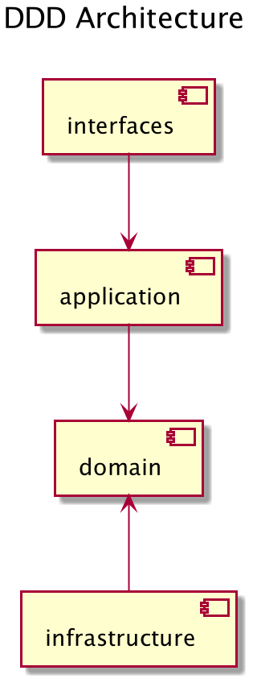
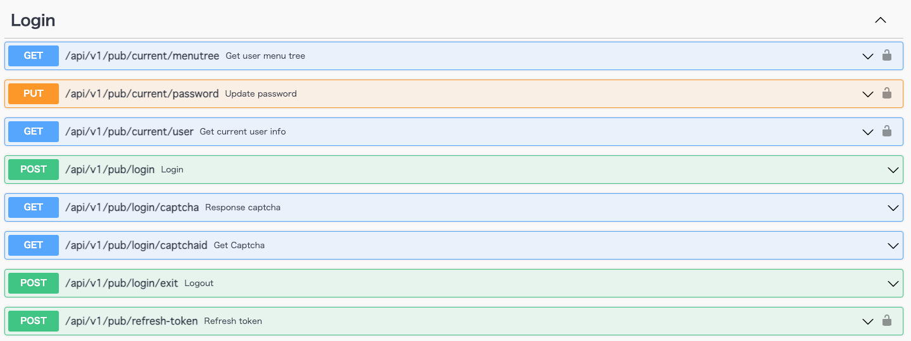

# ddd-gin-admin
[English](./README.md) | [简体中文](./README.zh-CN.md) | 日本語

`ddd-gin-admin` はDDDアーキテクチャを採用し、CMSの構築に必要なコンポーネントを提供します。RBACによるユーザー権限管理。

[](https://github.com/linzhengen/ddd-gin-admin/actions/workflows/golangci-lint.yml)

## DDD Architecture
+ Domain: Domain層は、アプリケーションのドメインとビジネスロジックが定義されます。
+ Infrastructure: Infrastructure層は、DBアクセスなどの技術的関心を記述します。この層はDomain層に依存しています。 そのためInfrastructure層はDomain層のrepositoryで定義したインタフェースを実装します。
+ Application: Application層は、ドメインとインターフェース層の間の通路として機能します。は、インターフェイス層からドメイン層に要求を送信し、ドメイン層はそれを処理して応答を返します。
+ Interfaces: Interfaces層は、Webアプリケーションやバッチ処理など、他のシステムと対話するすべてのものを保持します。
<div>
    
</div>

## Swagger UI
- GitHub Page: https://linzhengen.github.io/ddd-gin-admin/docs/swagger-ui/
- Localhost: http://localhost:8080/swagger/index.html
<div align="center">
    
</div>

## Compiles and hot-reloads for development
```
make skaffold-dev
```
## Starting tunnel via minikube for service ddd-gin-admin-web
```
minikube service ddd-gin-admin-web --url -n ddd-gin-admin
```
## Lint
```
make lint
```
## Build binary
```
make build
```

## references
+ https://dev.to/stevensunflash/using-domain-driven-design-ddd-in-golang-3ee5
+ https://github.com/LyricTian/gin-admin
