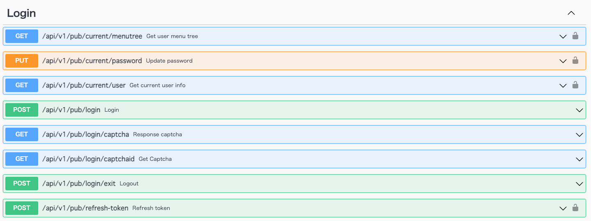

# ddd-gin-admin
[](https://github.com/linzhengen/ddd-gin-admin/actions/workflows/golangci-lint.yml)

## Swagger UI
- GitHub Page: https://linzhengen.github.io/ddd-gin-admin/docs/swagger-ui/
- Localhost: http://localhost:10088/swagger/index.html
<div align="center">
    
</div>

## Project setup
```
go mod download
```
## Compiles and hot-reloads for development
```
make start
```
## Lint
```
make lint
```
## Build binary
```
make build
```

## DDD comprises 4 Layers:
+ Domain: This is where the domain and business logic of the application is defined.
+ Infrastructure: This layer consists of everything that exists independently of our application: external libraries, database engines, and so on.
+ Application: This layer serves as a passage between the domain and the interface layer. The sends the requests from the interface layer to the domain layer, which processes it and returns a response.
+ Interface: This layer holds everything that interacts with other systems, such as web services, RMI interfaces or web applications, and batch processing frontend.
<div align="center">
    
</div>

## references
+ https://dev.to/stevensunflash/using-domain-driven-design-ddd-in-golang-3ee5
+ https://github.com/LyricTian/gin-admin
