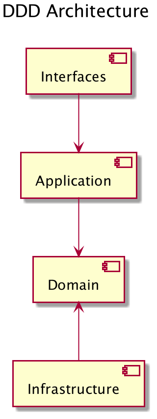

# ddd-gin-admin
English | [简体中文](./README.zh-CN.md) | [日本語](./README.ja.md)

This repository is a sample web application using DDD (Domain-Driven Design) architecture and Gin framework. Here's an overview of the features and technology stack provided in this repository.

[](https://github.com/linzhengen/ddd-gin-admin/actions/workflows/golangci-lint.yml)

## Features
This web application provides the following features:

- User registration, login, and logout
- User list display, detailed display, editing, and deletion
- Access control based on roles (administrator, general user)
- API documentation using Swagger

## Technology Stack
This web application uses the following technology stack:

- Golang
- Gin - Web framework
- GORM - ORM library
- MySQL - Database
- Swagger - API documentation generation tool
- K8s / Skaffold / Docker - Containerization

## DDD Architecture
+ Domain: This is where the domain and business logic of the application is defined.
+ Infrastructure: The infrastructure layer describes technical concerns such as DB access. This layer depends on the domain layer. Therefore, the infrastructure layer implements the interface defined in the repository of the domain layer.
+ Application: This layer serves as a passage between the domain and the interface layer. The sends the requests from the interface layer to the domain layer, which processes it and returns a response.
+ Interfaces: This layer holds everything that interacts with other systems, such as web services, RMI interfaces or web applications, and batch processing frontend.
<div>
    
</div>

## Swagger UI
- GitHub Page: https://linzhengen.github.io/ddd-gin-admin/docs/swagger-ui/
- Localhost: http://localhost:8080/swagger/index.html
<div align="center">
    
</div>

## Compiles and hot-reloads for development
```
make skaffold-dev
```
## Starting tunnel via minikube for service ddd-gin-admin-web
```
minikube service ddd-gin-admin-web --url -n ddd-gin-admin
```
## Lint
```
make lint
```
## Build binary
```
make build
```

## references
+ https://dev.to/stevensunflash/using-domain-driven-design-ddd-in-golang-3ee5
+ https://github.com/LyricTian/gin-admin
